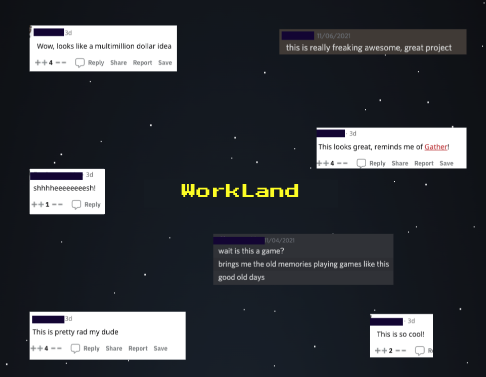
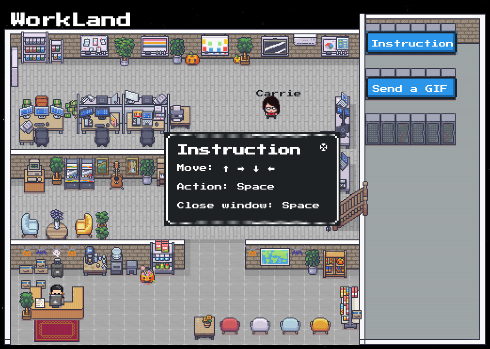
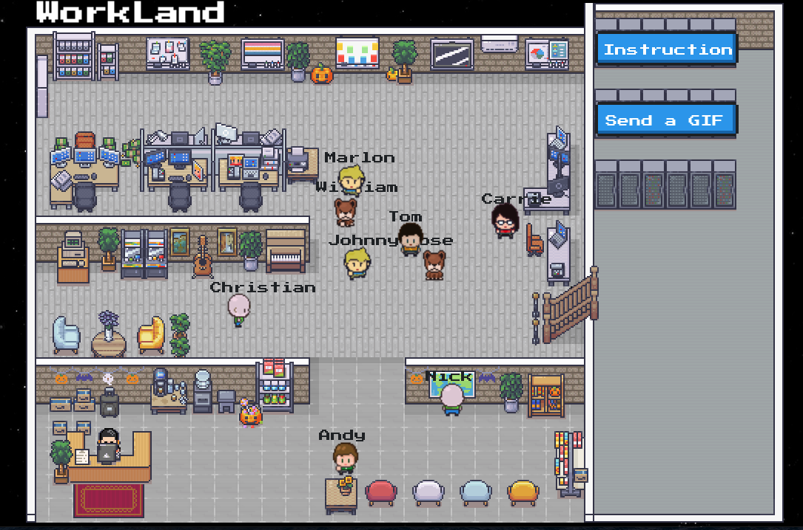
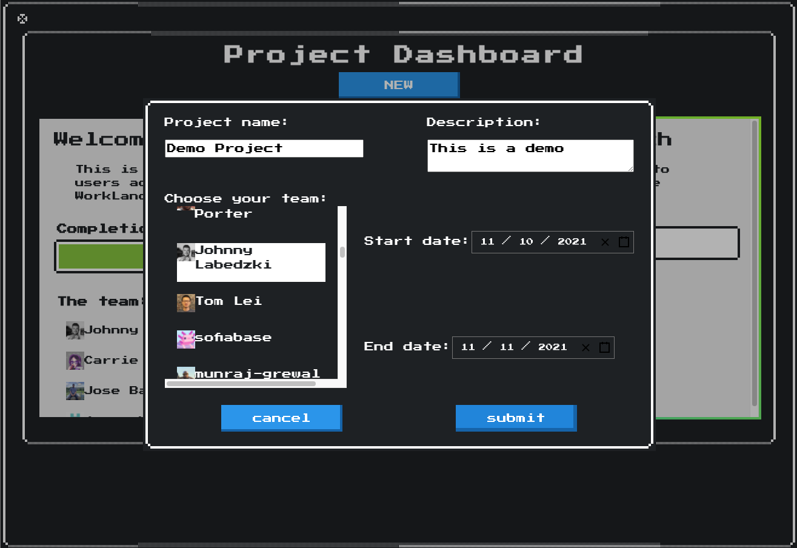
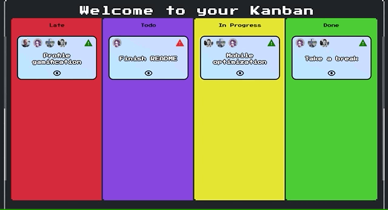

# Welcome to WorkLand

## About

WorkLand is a metaverse for tech teams. Team members can gather in WorkLand, manage projects, track tasks and get work done. WorkLand also features a break room.

- [Motivation](#motivation)
- [Demo](#demo)
- [Features](#features)
- [Tech Stack](#tech-stack)
- [Installation](#installation)
- [Known Issues](#known-issues)
- [Credits](#credits)



## Motivation

WorkLand is made by three developers, [Johnny](https://github.com/jlabedzki), [Jose](https://github.com/Josebautista10) and [Carrie](https://github.com/cgm42/) as a coding bootcamp demo project. As a remote team, we wanted to create something fun that fosters connectivity and boosts productivity at the same time.  

## Demo

Deployed on Netlify: [WorkLand](https://workland.netlify.app/).
Server hosted on Heroku.
Browser needs to support 3rd party cookies.

## Features

<!--  -->

### **Instruction**



### MMORPG-like Environment



### **Live GIF Chat**


### **Work Area**


### Project Management




### Task Management


### Kanban board



### **Break Room**

### 3D Globe

Shows location based on IP address of WorkLanders


### Guitar - thanks to [React-Guitar](https://github.com/4lejandrito/react-guitar)

https://user-images.githubusercontent.com/38818956/141935520-d8b9106a-c0f9-4638-87db-ac30aa3df914.mov

### Piano


### Aracade Machine


## Tech Stack

- Built using JavaScript, React, Redux(RTK)
- Back end used TypeScript, Node, Express, OAuth, passport, CORS
- Socket.io used for multiplayer movement and Snapchat-styled instant GIF messaging
- NES.CSS and RPGUI used for retro game styling
- React-beautiful-DND used for drag and drop on the Kanban page

### Database

- PostgreSQL

## Installation

Clone the repository with git:

```shell
git clone git@github.com:cgm42/WorkLand.git
```

Install dependencies in the client folder with [npm](https://npmjs.com):

```shell
npm workland
```

Install dependencies in the server folder:

```shell
npm i
```

## Known Issues

A small number of users seem to experience log in issues sometimes - refer to Issue #60

## Credits

### Pixel Art
Character sprites coursty of [Drew Conley](https://codepen.io/punkydrewster713), used under MIT license. 
Licensed interior and office assets purchased from [itch.io](https://limezu.itch.io/).

### Tutorials
To be updated. 

### Inspirations
Inspired by [WorkAdventure](https://github.com/thecodingmachine/workadventure) and Gather. 
